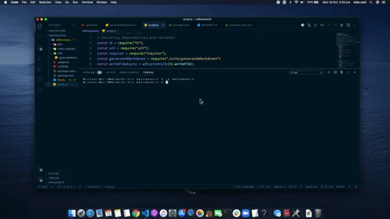

# README.md Generator:

    
    
    

## Description 

  
Every github project needs a quality README with information, about the app, what the app is for, how to use the app, how to install it, tests, and how to make contributions so that developers of all kinds are likely to use and contribute to the success of the project. 

This App is a command-line project that runs with Node.js that will dynamically generate a README.md file based on input about your project. Check out the [`README.md`](https://github.com/Michaelmw17/w8homework) in `dist` folder this repo as an example. 

## Table of Contents

* [Installation](#installation)
* [Demonstration](#demonstration)
* [Procedure](#Procedure)
* [License](#license)
* [Authors](#authors)
  

## Installation

To generate your own README, first run `npm install` in order to install the following npm package dependencies as specified in the `package.json` then run:

`npm init`
  
`npm install inquirer`

## Demonstration 

  
Or the full video is [here](./vid/ScreenRecording6.17.47pm.webm)  

## Procedure

The application utilizes scalability by separating the GitHub API call and generation of the markdown into separate modules: `script.js` and `generateMarkdown.js`, inside the `dist` folder.

The application also utilizes, as much as i could, new syntax introduced in ES6 and more, including `const`,`arrow functions`, template literals, and `async/await` as well as  handling `inquirer`, `init`, and `fs.writeFile` promises.

## License

- [UnLicense](https://unlicense.org)

## Authors 

Feel free to use for you own work to generate a README for your project.

GitHub: [@michaelmw17](https://github.com/Michaelmw17/w8homework)

Email: michaelmw17@outlook.com

## Resources  
 [@shields](https://shields.io/) 
 [@node.js](https://nodejs.org/api/modules.html#modules_module_exports) 
 [@node.js](https://nodejs.org/dist/latest-v8.x/docs/api/util.html#util_util_promisify_original) 
 [@node.js](https://nodejs.org/api/) 
 [@npm](https://www.npmjs.com/package/inquirer) 
 
 ## Questions

_Michael Watt_

- [Github!](https://github.com/Michaelmw17)
- [LinkedIn!](https://www.linkedin.com/in/michael-watt-6a76961b3/)
- [Portfolio!](http://michaelmw17.github.io/)
- Email:(michaelmw17@outlook.com)

 
